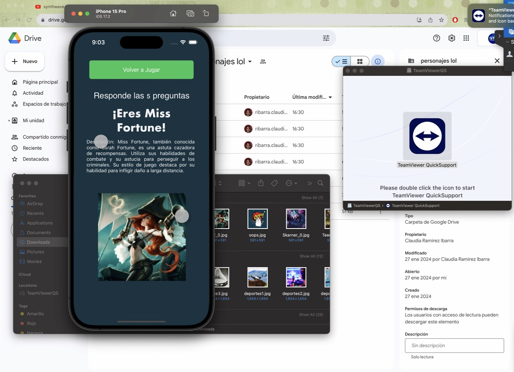

# Proyecto "¿Qué personaje eres?" fue creado según la política de la "Sección de parloteo legal" de Riot Games, utilizando los recursos de Riot Games.  Riot Games no apoya ni patrocina este proyecto.

## Aviso Legal
Este proyecto fue realizado por un fan con fines educativos, no se comercializará de ninguna manera ni se subirá a plataformas como appstore o playstore mientras contenga PI de Riot Games. 
[Aviso legal de riot games](https://www.riotgames.com/es/legal)

## Introducción
 "¿Qué personaje eres?", fue desarrollado como parte de la materia de Desarrollo de Aplicaciones Móviles en iOS. La aplicación tiene como objetivo que por medio de preguntas adivinemos qué personaje está pensando el usuario.
Para esta demo se utilizaron 5 personajes de la franquicia League of legends.

Teemo, Scarner, Twisted Fate, Miss Fortune y Jinx

## Perfil de usuario a quien va dirigido
**Edad:** Desde jóvenes de 16 años hasta adultos mayores 60+

**Nivel de Educación:** Todos los niveles educativos. El único requisito sería que sepan leer, pues aún no ha sido implementada la función para que los datos sean leidos por la aplicación.

**Experiencia Tecnológica:** Desde principiantes hasta usuarios avanzados. Se ha optado por una interfaz intuitiva que ayuda a la experiencia de usuario y sigue con las guias de diseños de los componentes ios.

**Frecuencia de Uso:** Diseñada para uso esporádico, debido a que la cantidad de personajes es limitada.

**Conocimiento del juego:** Esta aplicación podría estar permeada hacia personas que conozcan los 5 personajes del juego, pero en caso de que no se conociera a los personajes la aplicación da una descripción e imagen de los personajes para la siguiente iteración puedas pensar en ellos.

## Wireframe


## Main.storyboard
Los elementos gráficos fueron diseñados utilizando la interfaz gráfica de xcode, la cual permite una edición sencilla de los elementos contenidos en el archivo `Main.storyboard` [ir a archivo](Que_personaje_eres/Base.lproj/Main.storyboard).

## ViewController
En esta sección se encuentra el código core que hace funcionar a la aplicación. Cada elemento que es generado en Main.storyboard es definido y utilizado en `ViewController` [ir a archivo](Que_personaje_eres/ViewController.swift).

### Definición de variables
En el archivo ViewController encontramos la definición de las variables que se utilizarán. Se define una estructura que contiene las características de cada personaje; Nombre, descripción, imágen y las respuestas de las preguntas para dar con tal personaje, estas últimas son variables booleanas pues tienen como respuesta true o false.

Además de generar la estructura que se usará de base para cada personaje se agrega una arreglo de las preguntas que se harán. Y un arreglo donde se irán agregando las respuestas del usuario.

Por último tenemos la definición de los elementos gráficos que se utilizarán en la aplicación, las etiquetas, los cuadros de texto y botones.

```Swift

struct Personaje {
    let nombre: String
    let esHumano: Bool
    let tieneSombrero: Bool
    let esMujer: Bool
    let habla: Bool
    let llevaArmaDeFuego: Bool
    let descripcion: String
    let imagen: String
    }
var preguntas: [String] = ["¿Es humano?", "¿Tiene sombrero?", "¿Es mujer?", "¿Habla?", "¿Lleva arma de fuego?"]
var respuestasUsuario: [Bool] = []
    
var personajes: [Personaje] = [
    Personaje(nombre: "Jinx", esHumano: true, tieneSombrero: false, esMujer: true, habla: true, llevaArmaDeFuego: true, descripcion: "Jinx es una caótica y excéntrica artillera. Tiene una predilección por la destrucción y el caos, disfrutando de la emoción de la batalla. Su estilo de juego se centra en el uso de armas de fuego y explosivos.", imagen: "jinx_0.jpg")
        //resto de personajes
    ]

@IBOutlet weak var page_n: UITextField!
@IBOutlet weak var questions: UITextField!
@IBOutlet weak var title1: UILabel!
@IBOutlet weak var Instructions: UITextField!
@IBOutlet weak var response1: UIButton!
@IBOutlet weak var response2: UIButton!
@IBOutlet weak var imagen: UIImageView!
@IBOutlet weak var again: UIButton!
@IBOutlet weak var Descripcion_text: UITextView!
var totalQuestions = 1


```

### Función principal
La función principal contiene únicamente las inicializaciones de comenzar ocultas tanto de la imagen como de la descripción de los personajes que se utilizarán al final, además del llamado de la función mostrarPregunta()

```Swift
  override func viewDidLoad() {
        super.viewDidLoad()
        imagen.isHidden = true
        Descripcion_text.isHidden = true
        mostrarPregunta()
    }

```
### Función mostrarPregunta()
La función mostrar preguntas inicializa una variable llamada preguntaActual, la gual verifica que existan elementos dentro del array preguntas, en caso de que esté vacío determina que ya se han mostrado todas las preguntas y manda a llamar al resultado. Además en caso de que aún haya preguntas la pregunta será mostrada en el textfield questions.

```Swift
  func mostrarPregunta() {
        guard let preguntaActual = preguntas.first else {
            mostrarResultado()
            return
        }
        
        questions.text = preguntaActual
    }
```

### Botones Sí o No
Los botones de respuesta mandan a llamar la función siguiente pregunta además de que agregan al array respuestasUsuario "true" en caso de haber seleccionado el botón sí o "false" en caso de haber selecconado el botón no.
La función siguiente pregunta elimina el primer elemento del array de preguntas y vuelve a llamar a la siguiente pregunta, o en caso de que ya esté vacia la lista, llama al resultado. 
Adicionalmente se hacen actualizaciones a la paginación.

```Swift
    @IBAction func response1(_ sender: Any) {
        respuestasUsuario.append(true)
        siguientePregunta()
    }
    @IBAction func response2(_ sender: Any) {
        respuestasUsuario.append(false)
        siguientePregunta()
    }
    
    func siguientePregunta() {
        preguntas.removeFirst()
        
        if preguntas.isEmpty {
            mostrarResultado()
        } else {
            mostrarPregunta()
        }
        totalQuestions += 1
        page_n.text = "\(totalQuestions)/5"    }
```
### Función mostrarResuldo()
Dentro de esta función se actualiza la visualización de elementos, ocultando los que ya no son necesarios y mostrando los que sí. Además se hace el conteo de valores True en las respuestas del usuario y dependiendo de cuántos true obtuvo se determina a qué personaje pertenece, esto se hace gracias a la estructura iterativa switch. 
| Personaje        | Trues Necesarios | 
|------------------|------------------|
| Jinx             |    4             | 
| Miss Fortune     |    5             | 
| Twisted Fate     |    3             | 
| Teemo            |    2             | 
| Skarner          |    0             | 

```Swift
    func mostrarResultado() {
        let sumaRespuestas = respuestasUsuario.reduce(0, { $0 + ($1 ? 1 : 0) })
        // Muestra la imagen
        imagen.isHidden = false
        questions.isHidden = true
        Descripcion_text.isHidden = false
        switch sumaRespuestas {
        case 4:
            title1.text = "¡Eres \(personajes[0].nombre)!"
            Descripcion_text.text = "Descripción: \(personajes[0].descripcion)"
            imagen.image = UIImage(named: personajes[0].imagen)
        case 5:
            title1.text = "¡Eres \(personajes[1].nombre)!"
            Descripcion_text.text = "Descripción: \(personajes[1].descripcion)"
            imagen.image = UIImage(named: personajes[1].imagen)
        case 3:
            title1.text = "¡Eres \(personajes[2].nombre)!"
            Descripcion_text.text = "Descripción: \(personajes[2].descripcion)"
            imagen.image = UIImage(named: personajes[2].imagen)
        case 2:
            title1.text = "¡Eres \(personajes[3].nombre)!"
            Descripcion_text.text = "Descripción: \(personajes[3].descripcion)"
            imagen.image = UIImage(named: personajes[3].imagen)
        case 0:
            title1.text = "¡Eres \(personajes[4].nombre)!"
            Descripcion_text.text = "Descripción: \(personajes[4].descripcion)"
            imagen.image = UIImage(named: personajes[4].imagen)
        default:
            title1.text = "No se pudo determinar el personaje."
            Descripcion_text.text = ""
            imagen.image = UIImage(named: "oops.jpg")
        }
        page_n.isHidden = true
        //desactivar visibilidad de botones
        response1.isHidden = true
        response2.isHidden = true
    }
```
### Botón Jugar de nuevo
Por último se incorpora el código necesario para que pueda resetearse cada valor y el juego vuelva a empezar. Lo importante es llenar nuevamente las preguntas y reestablecer los textos y visibilidad de los elementos necesarios.


```Swift
    @IBAction func again(_ sender: UIButton) {
        preguntas = ["¿Es humano?", "¿Tiene sombrero?", "¿Es mujer?", "¿Habla?", "¿Lleva arma de fuego?"]
        respuestasUsuario = []
        title1.text = "¿Qué personaje eres?"
        Instructions.text = "Responde a las 5 preguntas"
                
        // Desactiva la visibilidad de la imagen al volver a jugar
        imagen.isHidden = true
                
        // Activa la visibilidad de los botones response1 y response2 al volver a jugar
        response1.isHidden = false
        response2.isHidden = false
        Descripcion_text.isHidden = true
        questions.isHidden = false
        totalQuestions = 1
        page_n.text = "1/5"
        page_n.isHidden = false
        mostrarPregunta()
    }
    
```
## Capturas de aplicación en funcionamiento

A continuación se tiene algunas imágenes del funcionamiento de la aplicación:
### Pregunta 1

### Pregunta 2

### Pregunta 3

### Pregunta 4

### Pregunta 5

### Personaje 1

### Personaje 2

### Personaje 3

### Personaje 4

### Personaje 5
